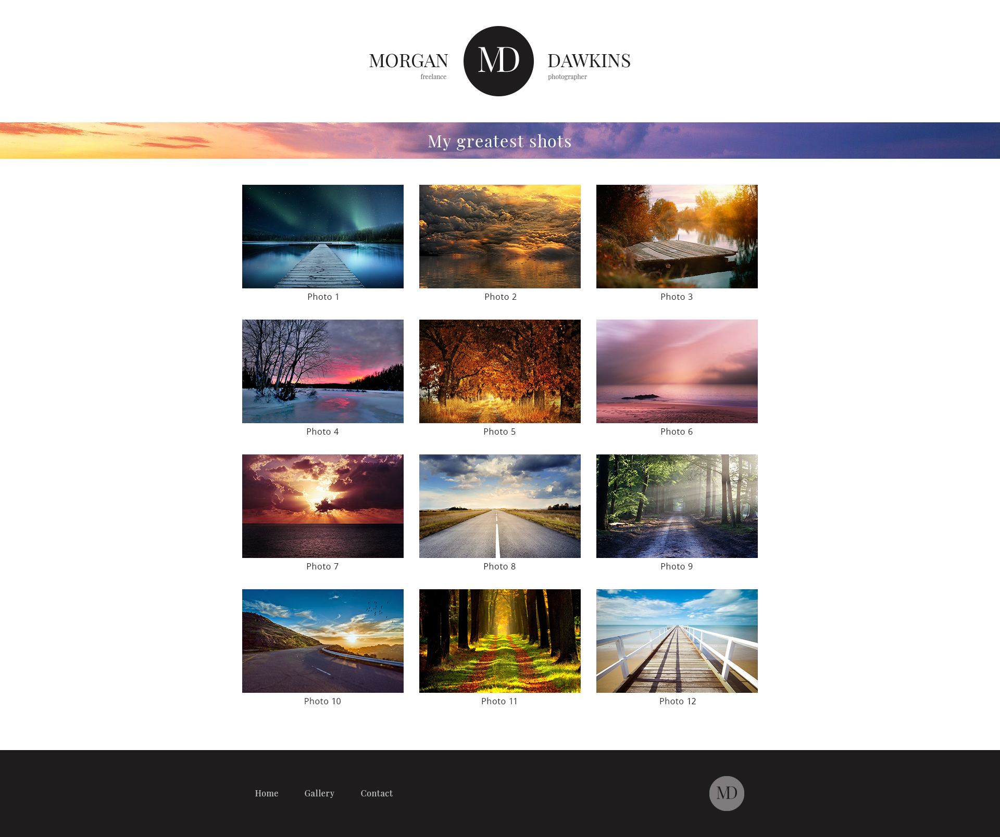
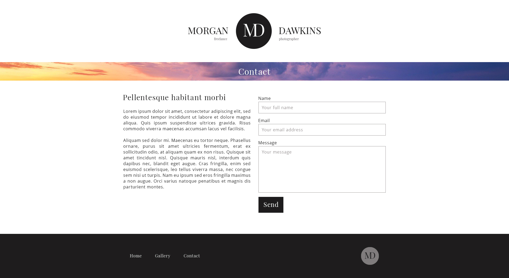

ekyna-learn/html-css-portfolio
===

Intégration HTML/CSS d'un site internet : portfolio de photographe.

### Accueil

Fichier __index.html__.

[Version annotée](doc/01-home-annotated.jpg)

### Galerie

Fichier __gallery.html__.

[Version annotée](doc/02-gallery-annotated.jpg)

### Contact

Fichier __contact.html__.

[Version annotée](doc/03-contact-annotated.jpg)
